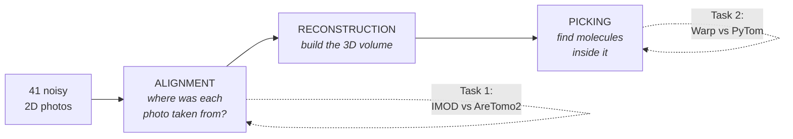
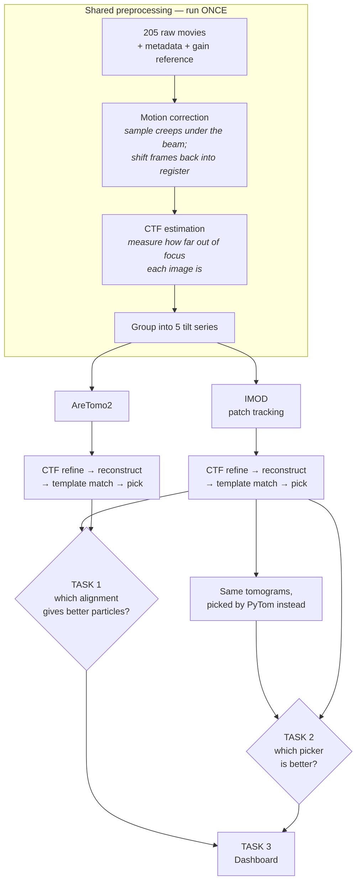

# Cryo-ET, explained from zero

No background assumed. Read this before the assessment PDF and it will make
sense. Every technical word is defined the first time it appears.

---

## 1. The 60-second version

You want to know the exact shape of a protein molecule — a machine about
**a hundred-thousandth the width of a human hair**. No microscope can simply
"look" at one, so you photograph a frozen sample from 41 different angles,
computationally reassemble those into a 3D volume, and then hunt for individual
molecules inside it.

Two of those steps can be done by more than one program, and nobody has
carefully checked whether the choice matters. That is what the assessment asks
you to find out.



---

## 2. The problem: seeing something too small to see

Light microscopes cannot resolve a protein. Light waves are simply too big — like
trying to feel the texture of sandpaper while wearing boxing gloves.

Electrons have a far shorter wavelength, so an **electron microscope** can. But
electrons are absorbed by air and by water, so the sample must be in a vacuum,
and a protein in a vacuum dries out and collapses.

**Cryo-EM** ("cryo" = cold) solves this. Freeze the sample so fast — milliseconds,
against a metal block cooled by liquid ethane — that water molecules have no time
to arrange into ice crystals. You get **vitreous ice**: water frozen as a glass.
The proteins are held exactly as they were in solution, and the whole thing
survives the vacuum.

> **Why this earned a Nobel Prize (Chemistry, 2017):** it let biologists see
> molecular machines in their natural shape, without crystallising them first.

### The catch that shapes everything

Electrons destroy what they illuminate. Every electron you fire has a chance of
breaking a chemical bond. Turn the beam up for a clear picture and you are
photographing rubble.

So you use the smallest dose you can — for this dataset, **2.64 electrons per
square Ångström per image**, which is almost nothing. The consequence:

```
   What a single image looks like:          What is actually there:

   ░▒░░▓░▒▓░░▒░▓▒░░▓░▒░░▒▓░░▒░▓░           . . . . . . . . . . . .
   ▒░▓░▒░░▓▒░░▒░▓░▒▓░░▒▓░░▒░▓░▒            . . . . o . . . . o . .
   ░░▒▓░▒░▓░░▒▓░░▓▒░░▒░▓░▒░░▓░▒            . o . . . . . . . . . .
   ▓░▒░░▓░▒▓░░▒▓░▒░░▓▒░░▒▓░░▒░             . . . . . . o . . . . o
   ░▒▓░░▒░▓░▒░░▓▒░░▓░▒▓░░▒░▓░▒░            . . o . . . . . . . . .

        pure-looking noise                  molecules, invisible individually
```

You genuinely cannot see the molecules. Everything downstream is about
extracting signal that is far below the noise floor — which is why alignment
accuracy matters so much, and why the whole exercise is worth benchmarking.

---

## 3. From 2D shadows to a 3D volume

An electron micrograph is a **projection**: everything along the beam path
squashed into one plane. Like an X-ray of a hand — you see all the bones at once,
overlapping, with no sense of which is in front.

One projection cannot give you 3D. Many projections from different angles can.
This is exactly how a hospital **CT scan** works, and the mathematics is the
same.

```
        electron beam
             │││││
    ─────────┼┼┼┼┼─────────   sample tilted to −40°
             ↓↓↓↓↓
          [ image 1 ]

             │││││
    ─────────┼┼┼┼┼─────────   sample tilted to 0°
             ↓↓↓↓↓
          [ image 21 ]

             │││││
    ─────────┼┼┼┼┼─────────   sample tilted to +40°
             ↓↓↓↓↓
          [ image 41 ]
```

**Tilt series** — the set of 41 images. **Tomogram** — the 3D volume reconstructed
from them. ("Tomo" = slice; a tomogram is something you can slice through and
look inside.) **Cryo-ET** = cryo-electron tomography = this whole technique.

### The missing wedge

You cannot tilt past about ±60° — the sample holder gets in the way, and at high
tilt the beam passes through so much ice that nothing is visible. So a cone of
viewing angles is permanently missing. Tomograms are always slightly smeared
along the beam direction. Nothing fixes this; you work around it.

```
        ↑ z (beam)
        │
   ╲    │    ╱     ← angles you CAN collect (−40° … +40°)
    ╲   │   ╱
  ───╲──┼──╱───→ x
      ╲ │ ╱
       ╲│╱
   the missing wedge: angles you can never reach
```

---

## 4. Why alignment is the hard part

To reconstruct, you must know **precisely** where each of the 41 images was taken
from. The microscope tells you the nominal angle — but:

- the stage mechanically wobbles when it rotates
- the sample drifts as it warms under the beam
- the tilt axis is not exactly where the software thinks it is

Errors of a few pixels are enough to smear the reconstruction into mush. So you
recover the true geometry **from the images themselves**.

```
   Good alignment                     Poor alignment
   projections agree                  projections disagree

        ╲ │ ╱                              ╲   │  ╱
         ╲│╱                                 ╲ │ ╱
          ●    ← sharp                       ◌ ◍ ◌   ← smeared
         ╱│╲                                ╱  │  ╲
        ╱ │ ╲                              ╱   │   ╲
```

**Two programs, two philosophies — this is Task 1:**

| | **IMOD patch tracking** | **AreTomo2** |
|---|---|---|
| Idea | Cut each image into small squares. Follow each square from one tilt to the next by cross-correlation. Fit a geometry explaining all the tracks. | Never track anything. Build a rough 3D volume, re-project it back to 2D, compare with the real images, correct the geometry, repeat. |
| Analogy | Following individual landmarks between frames of a film | Guess the answer, check it, refine the guess |
| Strength | Very accurate when there is enough texture to track | Fast, fully automatic, no features required |
| Weakness | Needs trackable texture; slower | Can converge badly on some datasets |
| Runs on | CPU mostly | GPU |

---

## 5. Finding molecules once you have a tomogram

The molecules are still invisible individually. But you already know roughly
what shape you are looking for — someone has solved the structure before, and
deposited it in a public database.

So: take that known 3D shape (the **template**), and slide and rotate it through
every position and orientation in the tomogram, scoring how well it fits each
time. Peaks in that score are your molecules. This is **3D template matching**.

```
   template            slide + rotate through the volume        score map
                       ────────────────────────────────▶
     ⬡                  ░░░░░░░░░░░░░░░░░░░░░░              ░░░░█░░░░░░░░
                        ░░░░░░░⬡░░░░░░░░░░░░░░              ░░░░░░░░░░█░░
   (known shape)        ░░░░░░░░░░░░░░⬡░░░░░░░              ░░█░░░░░░░░░░
                        ░░░⬡░░░░░░░░░░░░░░░░░░              ░░░░░░░█░░░░░
                            tomogram                    peaks = molecules
```

Rotation is what makes this expensive. The molecules point in random directions,
so you must try many orientations — a 7.5° grid over all of 3D rotation space is
a *lot* of trials, and each one is a full 3D correlation.

**Symmetry is the shortcut.** Apoferritin, the molecule here, is a hollow shell
so symmetric that **24 different rotations leave it looking identical**
(*octahedral symmetry*, written **O** — the symmetry of a cube). So you only
need to search 1/24 of orientation space. Telling the software `C1`, meaning
"no symmetry", costs a factor of twenty-four for no benefit.

**Two programs, again — this is Task 2:**

| | **Warp** built-in | **PyTom** |
|---|---|---|
| Origin | Same package that does everything else | Separate, from Utrecht |
| Symmetry | Full octahedral (all 24) | Only rotations about one axis (4 here) |
| Score | Standard deviations above the volume's own noise | Normalised cross-correlation coefficient |
| Threshold | You pick a cutoff | Estimates its own from a false-alarm rate |

> **The scores are not interchangeable.** "7.2 sigma above background" and
> "correlation 0.34" are different quantities on different scales. Plotting them
> on a shared axis, or rescaling both to 0–1 to make them "comparable", invents a
> relationship that does not exist. Where the analysis compares them, it compares
> **rankings**, which is scale-free.

---

## 6. The cast of software

| name | what it is | what it does here |
|---|---|---|
| **Warp / WarpTools** | Cryo-EM/ET processing suite. `WarpTools` is its command line. | Runs the whole pipeline. It doesn't align by itself — it *calls* IMOD or AreTomo2 for that. |
| **IMOD** | Long-established tomography toolkit (Univ. of Colorado). **etomo** is its alignment program. | Alignment method A |
| **AreTomo2** | Modern GPU aligner (Chan Zuckerberg Imaging Institute) | Alignment method B |
| **PyTom** (`pytom-match-pick`) | Standalone GPU template matcher (Utrecht) | Picking method B |
| **EMPIAR** | Public archive of *raw* microscope data | Source of the 5 tilt series |
| **EMDB** | Public archive of *solved 3D structures* | Source of the template, EMD-15854 |
| **RELION / M** | Downstream averaging + refinement | Not used here — the natural next step |

### The sample and the reference

**EMPIAR-10491** — five tilt series of **apoferritin**, an iron-storage protein.
A hollow shell ~130 Å across (1 Å = one ten-billionth of a metre; a water
molecule is about 3 Å). Rigid, abundant, highly symmetric — the standard test
specimen of cryo-EM. Everyone knows what the right answer looks like, which is
exactly what you want in a benchmark.

**EMD-15854** — a published 1.8 Å map of that same apoferritin, used as the
template. Both pickers use this identical file.

> ⚠️ EMD-15854 is sometimes mistaken for a **ribosome** (a ~300 Å molecular
> machine), and EMPIAR-10491 for **EMPIAR-10164** (immature HIV virus particles).
> Both errors are costly: template diameter, mask size, symmetry and the distance
> tolerance for "same particle" all follow from the molecule being a 130 Å
> octahedral shell.

---

## 7. The full pipeline



**Why preprocessing runs once and then branches:** motion correction and CTF
estimation take hours and have nothing to do with alignment. Running them twice
wastes that time *and* introduces a difference between the branches that isn't
the thing you're testing. Warp's `--output_processing` flag redirects output into
a separate folder, so both aligners start from byte-identical inputs.

### What "CTF" means

An electron microscope does not form a clean image. It applies an oscillating
**Contrast Transfer Function** that depends on how far out of focus you are — it
boosts some levels of detail, suppresses others, and *inverts* others entirely.
To recover the true structure you must measure the defocus of every image and
correct for it. Warp reads it from the interference rings in the image's power
spectrum.

There is also a sign ambiguity — across a tilted sample, is the left side closer
to focus, or the right? Getting it backwards quietly costs you resolution.
`ts_defocus_hand --check` measures it; our script **reads the answer and acts on
it** rather than assuming, because the two official Warp examples disagree about
which way this dataset goes.

---

## 8. The three tasks, stated plainly

### Task 1 — Does the alignment method matter?

Process the same data twice, changing **only** the aligner. Carry *both* branches
all the way through to particle picking — the assessment says so explicitly, and
for good reason: the question isn't "which program reports a smaller internal
error", it's "which alignment lets you find better molecules".

> **The trap.** Both programs print an "error" when they finish, and it's
> tempting to declare the smaller number the winner. **That comparison is
> invalid.** IMOD reports the average distance, in pixels, between where it
> predicted a tracked patch would land and where it actually landed. AreTomo
> reports an error from a completely different projection-matching calculation.
> Different quantities, different scales — like saying a golfer beat a
> basketball player because they scored fewer points.

So we judge on things that mean the same for both:

| measured | why it's fair | why it's meaningful |
|---|---|---|
| **Tomogram sharpness** | same reconstruction code, same pixel size | alignment error = blur |
| **Tomogram contrast** | same | smeared volumes drift toward uniform grey |
| **Particles found** | same picker, same template | blurred molecules are harder to find |
| **Peak score (σ)** ⭐ | Warp normalises to each volume's own background | *the* measure: how clearly molecules stood out |
| **Do both branches agree on positions?** | pure geometry | catches a grossly wrong alignment |
| **Runtime** | same GPU, same worker count | practical cost |

### Task 2 — Does the particle picker matter?

Same tomograms, same template, same particle diameter, same 7.5° angular step.
Only the program changes.

The hard question is: when Warp says a molecule is *here* and PyTom says *there*,
are those the same molecule?

```
   Warp picks:    ●        ●     ●            ●
   PyTom picks:     ✕      ✕         ✕    ✕

                  └┬┘      └┬┘   └─┬─┘   └┬┘  └┬┘
                 same     same   too far  ?    Warp-only
```

Three things make this honest:

1. **Optimal one-to-one matching.** Nearest-neighbour double-counts; first-come-
   first-served makes the answer depend on the order the file happened to be
   written in. We use the Hungarian algorithm — the pairing with the smallest
   total distance, each pick used at most once.
2. **The tolerance is swept, not chosen.** "How close counts as the same
   particle" is the single most manipulable number here. Our operating point is
   **65 Å = one apoferritin radius** — beyond that, two "matching" centres
   describe spheres that barely overlap. The full 10–200 Å curve is published
   alongside, and the dashboard makes it a slider.
3. **Claims get tested.** "The picks only one tool finds are its false positives"
   sounds obvious. It's testable, so we test it, and the report states whichever
   answer the data gives — including *not confirmed*.

### Task 3 — The dashboard

A page anyone can open to see both comparisons, the conclusions, and the exact
settings and software versions that produced them. Every number and every verdict
is computed from the result tables. Move the two sliders and watch the answer
move — that's the honest way to present a result that depends on a threshold.

> A dashboard with its conclusions written into the source is a poster with extra
> steps, and it will eventually tell a confident lie.

---

## 9. Glossary

| term | meaning |
|---|---|
| **Å (Ångström)** | One ten-billionth of a metre. Water ≈ 3 Å, apoferritin ≈ 130 Å |
| **Alignment** | Recovering exactly where each tilt image was taken from |
| **CTF** | Contrast Transfer Function — the distortion the microscope applies; must be measured and corrected |
| **Defocus** | How far out of focus an image is. Deliberately varied — some defocus is needed for contrast |
| **Dose** | Electrons per Ų delivered. More = better signal but more damage |
| **Gain reference** | Calibration image of the camera; every movie is divided by it |
| **`.mdoc`** | Text file listing which movie is which tilt angle |
| **Missing wedge** | Angles you can never collect, because the holder blocks them |
| **MRC** | Standard file format for cryo-EM images and volumes |
| **Pixel size (Å/px)** | Real-world size of one pixel. 0.7894 Å raw; 10 Å for processing |
| **Projection** | A 2D image: everything along the beam squashed flat |
| **Reconstruction** | Building the 3D volume from aligned projections |
| **Residual** | A program's own estimate of its fitting error. Meaningful within one program, **not across programs** |
| **STAR file** | Text table format used for particle lists |
| **Symmetry (C1, C4, O)** | C1 = none; C4 = 4-fold about one axis; O = octahedral (24 rotations) |
| **Template matching** | Sliding a known 3D shape through a volume to find copies of it |
| **Tilt series** | The set of images taken at different angles |
| **Tomogram** | The reconstructed 3D volume |
| **Vitreous ice** | Water frozen so fast it's a glass, not crystals |
| **Voxel** | A 3D pixel |

---

## 10. Where to go next

- **Setup, data, and how to run:** [`README.md`](README.md)
- **The parameters:** [`config.py`](config.py) — every number, with its source
- **The workflow:** [`run_workflow.py`](run_workflow.py) — each stage explained inline
- **The analysis:** [`analyze.py`](analyze.py) — statistics and why each was chosen
- **The original tutorial this reproduces:**
  <https://warpem.github.io/warp/user_guide/warptools/quick_start_warptools_tilt_series/>
